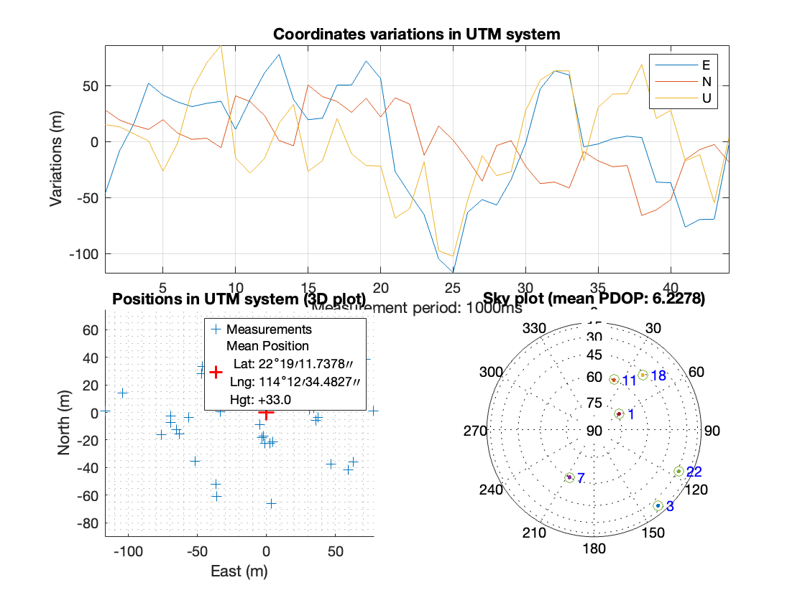

# Assignment 1

## Matlab code can be found in [GPS_L1_CA](/GPS_L1_CA) folder, plotted images are in [image](/image) folder.

# Task 1-Differential GNSS Positioning

```  
Model: ChatGPT-4o & DeepSeek-R1 
Prompt: (1) Please help me compare the pros and cons of DGNSS, RTK, PPP and PPP-RTK for smartphone positioning.
(2) please specify the difficulty of smartphone RTK and PPP.
(3) Please add some comparison between them in smartphone positioning in challenging environments like urban areas.
Comment: Both ChatGPT-4o and DeepSeek-R1 are free and powerful tools to answer these questions, it is great to refer to answers from them.
```  


There are multiple differences between these four positioning methods. Firstly, brief principles of these methods are introduced:

1. Differential GNSS(DGNSS): It works by correcting the GNSS pseudorange measurements of a user receiver by comparing them with that of a nearby reference station with known precise coordinates.

2. Real-Time Kinematic(RTK): It uses a combination of pseudorange and carrier-phase measurements and real-time corrections from a nearby reference station to achieve centimeter-level accuracy.

3. Precise Point Positioning(PPP): It utilizes precise satellite orbit and clock data to correct GNSS errors in pseudorange and carrier-phase measurements,enabling high-accuracy positioning globally without the need for local reference stations.

4. PPP-RTK: It integrates precise satellite orbit and clock corrections derived from PPP with real-time atmospheric corrections and regional reference network data as RTK, which facilitates centimeter-level positioning with fast times.

For smartphone navigation, there are several limitations in hardware and software in smartphone's GNSS module. Here listed the major limitations:

1. Antenna limitations: Smartphones typically use compact, linearly polarized(LP)antennas optimized for voice and data communication rather than GNSS signal reception. Therefore, smartphones are more susceptible to multipath interference, which is ubiquitous in urban and tree-shaded environments.

2. Carrier-Phase measurement challenges: Many smartphones lack the capability to provide reliable carrier-phase data due to duty-cycle operation, which intermittently turns GNSS modules off to conserve battery life and disrupts the continuity required for carrier-phase measurements.

3. Dependance on external correction services: Real-time correction data from reference stations and correction data for PPP requires available infrastructure,reliable internet access, and compatible applications with possible subscription-based services.

4. Processing constraint: The calculational demand of RTK, PPP and PPP-RTK might exceed the capabilities of smartphone processors, leading to delays and inaccuracies.

According to the aforementioned conditions, the pros and cons for each method in smartphone navigation are listed above:

### 1. DGNSS

●Pros:

i. Low cost and high compatibility: DGNSS only requires pseudorange measurements, available for single-frequency receivers, integrates easily with smartphone-grade antennas, and has low computational complexity, making it widely supported by smartphones.

● Cons:

i. Limited accuracy: Code-phase measurement is less accurate than carrier-phase, preventing it from achieving centimeter-level accuracy. Moreover, pseudorange is sensitive to multipath interference in urban canyons, which can cause significant degradation.

ii. Dependency on base stations: Requires dense regional reference networks(30-50 km spacing), which are often unavailable in remote or underdeveloped areas.

### 2.RTK

● Pros

i. High accuracy: Achieves cm-level accuracy in open-sky conditions,as demonstrated by dual-frequency smartphones like Huawei P40 and Xiaomi Mi 8.

ii. Fast initialization: Fixes ambiguities in seconds under ideal conditions, making it suitable for short-term urban tasks

● Cons:

i. Signal vulnerability: Urban obstructions can disrupt carrier-phase tracking and cause frequent reinitializations and accuracy degradation.

ii. Dependency on base stations: Requires ultra-dense base stations(<15 km spacing), which are costly and unavailable in remote or underdeveloped areas.

iii. Low compatibility: Requires dual-frequency code-phase and carrier-phase measurements to reach high-accuracy.

### 3. PPP

● Pros

 i. Independently of base stations: available globally, ideal for smartphones in areas without RTK infrastructure(e.g., deserts,oceans).

ii. High accuracy: achieves centimeter-level to decimeter-level accuracy with smartphones in open areas.

iii. Privacy Protection: No need to share user location data with third-party servers.

● Cons:

i. Slow convergence: Takes 20-30 minutes to achieve full accuracy,leading to high latency.

ii. Signal vulnerability: same as RTK.

iii.Low compatibility: same as RTK.

### 4. PPP-RTK

●Pros

 i. Balanced performance: Achieves centimeter-level accuracy with convergence time of less than 1 minute in open areas.

ii. Lower requirements on base stations: Requires only hundreds of kilometers spaced base stations to maintain accuracy.

● Cons:

i. Service complexity: Relies on real-time SSR(State Space Representation) corrections, demanding stable internet or satellite links.

ii. Signal vulnerability: same as RTK and PPP.

iii. Low compatibility: same as RTK and PPP.

Overall, the pros and cons of these four methods for smartphone navigation could be summarize as the table below:


(Figure source: https://www.swiftnav.com/resource/-are-the-different-gnss-correction-methods)

Urban areas present significant challenges to GNSS positioning due to signal blockage,multipath effects, and poor satellite visibility. In this task, you are provided with a skymask, which indicates the elevation angle representing potential satellite visibility blockage for each corresponding azimuth angle, at the ground truth of the"Urban"environment in Assignment 1.

# Task 2- GNSS in Urban Areas

The skymask given could be used to determine whether the LOS signal from a satellite is blocked. The building boundary skymask and the blocked satellites are shown below:


The code is modified in (GPS_L1_CA/Skymask.m) and (GPS_L1_CA/leastSquarePos.m)

	Weighting Scheme:
	•	LOS satellites: weight = (sin(elevation))²
	•	Blocked satellites: weight = 0.5 * (sin(elevation))²
 
The traditional elevation angle weighted least square positioning results are shown below:



The skymask based weighted least square positioning results are shown below:


The comparison of the positioning results are shown as a Table:

| Method | Mean Error/m (E,N,U) | RMSE/m (E,N,U) |
|--------|--------------------|--------------|
| LS     | 41.8, 23.1, 34.2   | 49.8, 28.4, 42.5 |
| WLS    | 42.1, 21.9, 33.4   | 49.6, 27.1, 42.1 |

The comparison of 2D positioning results is plotted as below:


The results show that the skymask based weighting slightly improved the positioning result (majorly in N and U direction) in urban areas.

# Task 3- GPS RAIM(Receiver Autonomous Integrity Monitoring)

# Task 4- LEO Satellites for Navigation

```  
Model: ChatGPT-4o & DeepSeek-R1 
Prompt: (1) Please tell me the major difficulties and challenges of using LEO communication satellites (like Starlink, OneWeb, Orbcomm, etc.) for GNSS navigation.
(2) Please first specify the differences between GNSS positioning and LEO positioning
Comment: Both ChatGPT-4o and DeepSeek-R1 are free and powerful tools to answer these questions, it is great to refer to answers from them.
```  

LEO is different in multiple aspects compared to GNSS. The differences could be summarized as several points as follow:

### 1. Orbital difference:

● GNSS operate in Medium Earth Orbit(MEO) at altitudes around 20,000 km.This makes its coverage wide, but its signal is weakened significantly.

● LEO function at much lower altitudes, typically between 500-2,000 km.This means each satellite covers a much smaller area, but the shorter propagation distance results in stronger signal strength at the receiver Moreover, for constellations like Starlink, the number of satellites in operation has reached tens of thousands to ensure global signal availability.

### 2. Clock stability:

● GNSS is equipped with atomic clocks with nanosecond-level accuracy

● LEO typically uses oven-controlled crystal oscillators(OCXOs) which has much lower stability for time synchronization.

### 3. Measurements:

● GNSS relies on pseudoranges to calculate the time delay between satellite signal transmission and reception to determine position.

● LEO signal is hard to be decoded, therefore doppler measurement is currently the most popular measurement for LEO positioning.

### 4. Signal broadcasting:

● GNSS broadcast signals with 1-2 GHz frequency. This allows for lower free-space path loss and better atmospheric penetration. However, it also caused its susceptibility to interference.

•Popular LEO communication satellites like Starlink and OneWeb broadcast Ku or Ka band signals(12-40 GHz). These bands support greater data rates and can enhance resistance to interference.

•Another major difference is the beaming style. LEO satellites use narrow and steerable beams to realize directional beaming, reduces the likelihood of interference and allows for frequency reuse in different geographic areas.

Based on the differences above, the major difficulties and challenges of using LEO communication satellites for GNSS positioning are:

### 1. Orbit and Clock Determination:

a. Real-time precision: LEO satellites' rapid orbital motion(~ 7.8 km/s)demands ultra-precise real-time orbit determination(RTOD) and clock synchronization. Errors in dynamic modeling or GNSS-based onboard navigation can propagate quickly, degrading positioning accuracy.

b.Autonomous operation: Large constellations(e.g., Starlink with tens of thousands of satellites) require decentralized orbit determination algorithms to reduce computational load. However, partial inter-satellite ranging or kinematic methods may lead to discontinuous solutions in unfavorable visibility conditions

 C. Clock stability: LEO satellites often use low-cost oscillators(e.g., USO OCXO) with higher instability than GNSS atomic clocks. Periodic errors will complicate clock prediction.

2. Signal Structure and Compatibility:

a. Non-navigation signal design: Most LEO communication satellites are optimized for high-speed data transmission rather than navigation. Their signals lack standardized navigation-specific components like precise timing codes or synchronization markers, requiring extensive signal redesign.

b.Modulation complexity: Integrating navigation and communication signals(e.g., using OFDM or CCSK modulation) requires balancing bandwidth efficiency and positioning accuracy, which increases design complexity

3. Atmospheric Error Modeling

 a. lonospheric delay: LEO signals traverse a larger portion of the ionosphere compared to GNSS, introducing complex delay patterns. Traditional GNSS ionospheric models(e.g., Klobuchar) are insufficient for LEO-augmented systems.

b.Tropospheric and multipath effects: Lower orbital altitudes increase susceptibility to weather-related signal attenuation and ground reflections, especially in urban or polar regions.

4. Doppler and Dynamic Tracking

 a. High Doppler shifts: LEO satellites' velocity causes rapid frequency variations(~±100 kHz),requiring advanced receiver architectures(e.g.,adaptive phase-locked loops) to maintain signal lock.

b. Kinematic positioning challenges: Doppler-based positioning(e.g.,using carrier phase) demands centimeter-level stability in measurements.Small errors(e.g., 0.01 m/s) can lead to meter-level inaccuracies

5. Impact of commercial behavior

 a. Regional signal availability: Many LEO communication service providers(such as Starlink and OneWeb) only broadcast signals and provide services in certain areas, resulting in LEO signals not being available for positioning anywhere in the world.

b. Signal structure and encoding method are not public: The current method of obtaining LEO code phase and carrier phase is very complicated, so most researchers use Doppler observations for positioning, but the positioning accuracy is very low.

# Task 5- GNSS Remote Sensing

```  
Model: ChatGPT-4o & DeepSeek-R1 
Prompt: (1) Please tell me how GNSS remote sensing impacted GNSS.
(2) Please take GNSS-IR for a specific discussion.
Comment: Both ChatGPT-4o and DeepSeek-R1 are free and powerful tools to answer these questions, it is great to refer to answers from them.
```  

### The Impact of GNSS in Remote Sensing

Global Navigation Satellite Systems(GNSS), originally developed for positioning,navigation, and timing(PNT), have evolved into powerful tools for a wide range of scientific and practical applications. One particularly significant and innovative use is in the field of remote sensing, where GNSS signals are applied to observe and analyze the Earth's surface and atmosphere.

Traditional remote sensing relies on dedicated instruments onboard satellites or aircraft to measure physical parameters of the Earth's surface and atmosphere. In contrast,GNSS-based remote sensing uses the signals transmitted by navigation satellites not just for positioning, but as sources of opportunity. Since GNSS satellites broadcast continuously and globally, the signals they emit can be analyzed not only in direct reception, but also in reflection, scattering,and delay, providing diverse environmental insights.

This capacity is exemplified in applications like GNSS Radio Occultation(GNSS-RO) for atmospheric profiling, GNSS Reflectometry(GNSS-R) for surface moisture and ocean roughness, and GNSS-IR for surface height, snow depth, and vegetation monitoring These methods turn everyday GNSS receivers into remote sensing instruments capable of collecting geophysical data without modifying the original GNSS infrastructure.

### A focus on GNSS-IR

Among the GNSS remote sensing techniques that have emerged, GNSS Interferometric Reflectometry(GNSS-IR) stands out for its unique ability to extract environmental data from GNSS signals that have been reflected off the Earth's surface. This method represents a transformative development in Earth observation, offering low-cost,passive, and continuous monitoring capabilities across a wide range of disciplines.

GNSS-Interferometric Reflectometry(GNSS-IR) leverages the interference between the direct and reflected GNSS signals received by a ground-based antenna. As GNSS signals strike the Earth's surface, part of the signal is reflected and reaches the antenna with a slight delay relative to the direct path. The combination of these two signals produces an interference pattern in the signal-to-noise ratio(SNR) recorded by the receiver. By analyzing this pattern, researchers can infer properties about the reflecting surface.

One of the core strengths of GNSS-IR is its ability to measure vertical changes in the environment. For instance, the periodicity of the interference pattern can be directly related to the height of the antenna above the reflecting surface. When this height changes-due to rising snow levels, flooding, or tides-GNSS-IR can detect the variation with high precision. Moreover, because the reflection characteristics vary with surface roughness and dielectric properties, the technique can also be used to monitor soil moisture, snow density, and even vegetation growth.

### Applications and Impact of GNSS-IR

GNSS-IR has had a broad and growing impact across geosciences, environmental monitoring, and hazard assessment:

1. Snow and Ice Monitoring: GNSS-IR is highly sensitive to snow accumulation and melting. It can detect snow depth variations at centimeter-level accuracy,making it a valuable tool for hydrological modeling and avalanche risk assessment, particularly in remote and mountainous regions.

2. Coastal and Lake Monitoring: By installing GNSS receivers near coastlines or inland water bodies, researchers can monitor tides and lake levels in real time.This is especially useful in areas lacking conventional tide gauges, offering a cost-effective method for studying sea level rise and flood events.

3. Soil Moisture and Vegetation: GNSS-IR can estimate changes in soil moisture by observing variations in reflectivity. This has implications for agriculture, drought monitoring, and climate research. Similarly, variations in vegetation density affect signal scattering, allowing rough estimation of biomass changes.

4. Integration with Existing GNSS Networks: One of the most efficient aspects of GNSS-IR is its ability to extract remote sensing data from already-deployed GNSS networks. Many permanent GNSS stations, originally intended for tectonic studies or geodesy, are now dual-purposed to also collect environmental data using GNSS-IR, maximizing return on investment.

### Challenges and Future Directions

Despite its advantages, GNSS-IR is not without limitations.The method is most effective with antennas mounted close to the surface of interest; as such, applications at high elevations or urban environments can be constrained. Furthermore, the technique depends on high-quality SNR data, which not all GNSS receivers provide. Future developments are focusing on integrating multi-frequency and multi-constellation GNSS data, improving signal processing algorithms, and combining GNSS-IR with other remote sensing modalities for enhanced accuracy and robustness.

### Conclusion

GNSS-IR exemplifies how navigation technologies can be reimagined for environmental sensing, turning everyday satellite signals into scientific goldmines. Its ability to provide real-time, cost-effective, and high-resolution measurements of the Earth's surface makes it a valuable complement to traditional remote sensing systems. As GNSS constellations grow and diversify, GNSS-IR and similar techniques will play an increasingly vital role in monitoring our planet.

